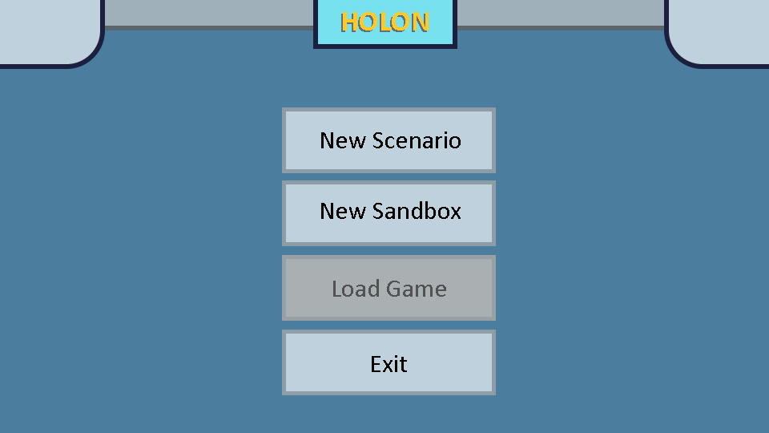
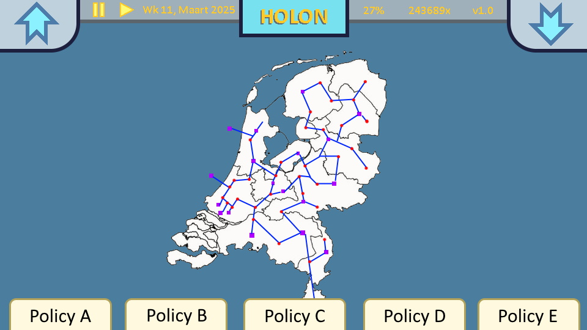
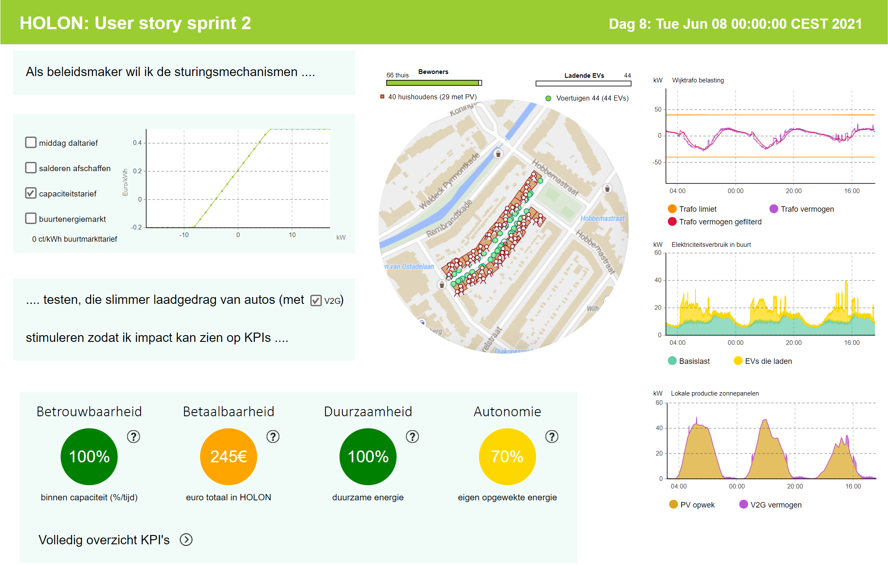

# HOLON

HOLON is a project that aims to enable modelers and policymakers to map the effects of social, financial and societal incentives on future energy systems using a bottom-up agent based modelling approach. AnyLogic is used to effectively and quickly develop agent based models. In a later stage, a collection of models will be consultable trough a web-interface with immersive gamified scenarios that form storylines. For advanced users, an open interface to the model collection will be made available.

## HOLON 2.1.0

This version of the model was created for the second sprint increment. It includes:
- Middag daltarief
- Salderen afschaffen
- Capaciteitsmarkt
- Buurt energiemarkt
- V2G optie

